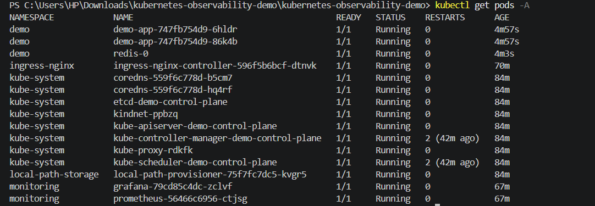
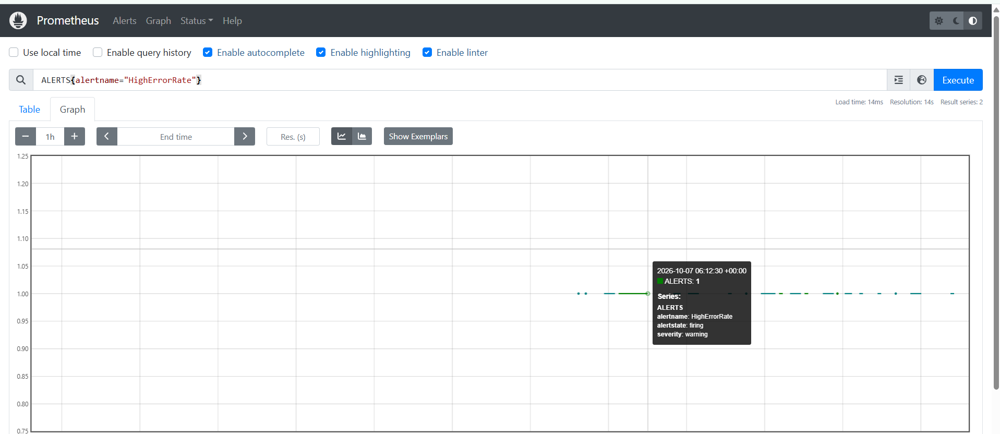
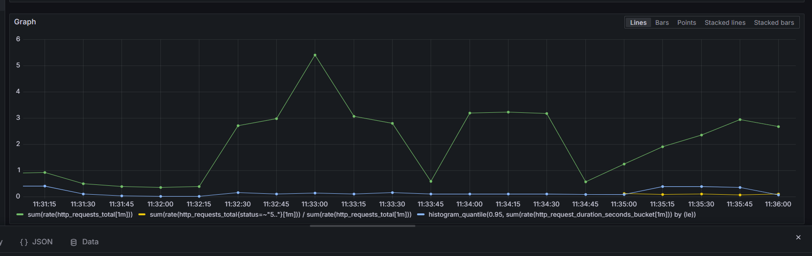

# Kubernetes Deployment with Monitoring

A containerized FastAPI service deployed to a local Kubernetes cluster with kind. The project has a Redis StatefulSet with persistent storage, an nginx ingress, health probes, rolling updates, and a Prometheus and Grafana monitoring stack with alert rules. Everything runs on a laptop and costs nothing.


## Overview

The service is a small FastAPI application with health, readiness, work and visit endpoints. It exposes Prometheus metrics at `/metrics`. It runs as two replicas in Kubernetes, stores a visit counter in Redis, and is reached from the browser through an nginx ingress on `http://localhost:8080`.

Prometheus scrapes the metrics, evaluates alert rules, and Grafana draws the graphs. A GitHub Actions workflow lints, tests and builds the Docker image on every push.

## What this project demonstrates

- Deploying a containerized service to Kubernetes with a Deployment, Service, Ingress and ConfigMap
- Zero downtime rolling updates with `maxUnavailable: 0` and `maxSurge: 1`
- Startup, readiness and liveness probes
- A Redis StatefulSet with a headless service and a persistent volume claim
- Resource requests and limits on every container
- Metrics with Prometheus counters and histograms
- Alert rules and dashboards queries for request rate, error ratio and p95 latency
- Troubleshooting with `kubectl describe`, `logs`, `rollout status` and `rollout undo`
- CI with GitHub Actions: flake8, pytest and a Docker build

## Architecture

```
                 Browser
                    |  http://localhost:8080
                    v
          +--------------------+
          |  nginx ingress     |   namespace: ingress-nginx
          +---------+----------+
                    |
                    v
          +--------------------+
          |  Service demo-app  |   namespace: demo
          +---------+----------+
                    |
        +-----------+-----------+
        v                       v
  +-----------+           +-----------+
  | demo-app  |           | demo-app  |   Deployment, 2 replicas
  |   pod     |           |   pod     |
  +-----+-----+           +-----+-----+
        |                       |
        +-----------+-----------+
                    v
          +--------------------+
          |  Redis StatefulSet |   persistent volume claim
          +--------------------+

  namespace: monitoring

  Prometheus  --- scrapes /metrics every 15 seconds ---> demo-app Service
      |
      +--> alert rules: HighErrorRate, AppDown
      |
  Grafana  --- reads from Prometheus ---> graphs
```

## Technology stack

| Area | Technology |
| --- | --- |
| Application | Python, FastAPI, Uvicorn |
| Storage | Redis 7 |
| Containers | Docker |
| Orchestration | Kubernetes, kind, kubectl |
| Ingress | ingress-nginx |
| Monitoring | Prometheus, Grafana |
| Testing | pytest, flake8 |
| CI | GitHub Actions |

## Project structure

```
kubernetes-observability-demo/
|
|-- .github/workflows/ci.yml        lint, test and Docker build
|-- app/
|   |-- __init__.py
|   `-- main.py                     FastAPI service
|-- tests/test_app.py               5 pytest tests
|-- k8s/
|   |-- kind-config.yaml            cluster with port 8080 mapped to ingress
|   |-- 00-namespace.yaml           demo and monitoring namespaces
|   |-- configmap.yaml              app configuration
|   |-- redis-statefulset.yaml      Redis with persistent storage
|   |-- deployment.yaml             app Deployment with probes
|   |-- service.yaml                ClusterIP Service
|   |-- ingress.yaml                nginx ingress rule
|   |-- monitoring/
|   |   |-- prometheus.yaml         config, alert rules, Deployment, Service
|   |   `-- grafana.yaml            data source, Deployment, Service
|   `-- optional/hpa.yaml           autoscaler, needs metrics-server
|-- scripts/                        up.sh, down.sh, load.sh for Linux and macOS
|-- docs/                           screenshots
|-- Dockerfile
|-- pytest.ini
|-- requirements.txt
`-- requirements-dev.txt
```

## API endpoints

| Method | Path | Description |
| --- | --- | --- |
| GET | `/health` | Liveness check, returns `{"status":"alive"}` |
| GET | `/ready` | Readiness check, returns 503 when `FORCE_NOT_READY=true` |
| GET | `/work?fail_rate=0.5&delay_ms=100` | Simulated work with optional random failures and delay |
| GET | `/visits` | Visit counter stored in Redis |
| GET | `/metrics` | Prometheus metrics |
| GET | `/docs` | Interactive API documentation |

## Prerequisites

- Docker Desktop, running
- kind
- kubectl
- Python 3.10 or newer
- Git

Check them:

```
docker --version
kind --version
kubectl version --client
```

## Getting started on Windows

The commands below are for PowerShell or the VS Code terminal. Run them from the project folder.

### 1. Test the app locally

```
py -m venv .venv
.venv\Scripts\Activate.ps1
pip install -r requirements-dev.txt
flake8 app tests
python -m pytest
deactivate
```

Expected result: `5 passed`.

### 2. Create the cluster

Port 8080 on your machine must be free. Stop anything else that uses it, for example a local Jenkins.

```
kind create cluster --name demo --config k8s\kind-config.yaml
kubectl get nodes
```

### 3. Build the image and load it into the cluster

```
docker build -t demo-app:1.0.0 .
kind load docker-image demo-app:1.0.0 --name demo
```

### 4. Install the ingress controller

```
kubectl apply -f https://raw.githubusercontent.com/kubernetes/ingress-nginx/main/deploy/static/provider/kind/deploy.yaml
kubectl wait --namespace ingress-nginx --for=condition=ready pod --selector=app.kubernetes.io/component=controller --timeout=180s
```

### 5. Deploy the app, Redis and monitoring

```
kubectl apply -f k8s\00-namespace.yaml
kubectl apply -f k8s\configmap.yaml -f k8s\redis-statefulset.yaml
kubectl rollout status statefulset/redis -n demo
kubectl apply -f k8s\deployment.yaml -f k8s\service.yaml -f k8s\ingress.yaml
kubectl rollout status deployment/demo-app -n demo
kubectl apply -f k8s\monitoring
kubectl rollout status deployment/prometheus -n monitoring
kubectl rollout status deployment/grafana -n monitoring
```

If the ingress apply fails with a webhook error, wait 30 seconds and run the same command again.

### 6. Check that it works

```
kubectl get pods -A
curl.exe http://localhost:8080/health
curl.exe http://localhost:8080/visits
curl.exe http://localhost:8080/visits
```

The visit number goes up on every call, and the response says `"store":"redis"`. The API documentation is at http://localhost:8080/docs.

## Getting started on Linux or macOS

```
./scripts/up.sh
```

The script creates the cluster, builds and loads the image, installs the ingress controller, and deploys everything. Remove the cluster with `./scripts/down.sh`.

## Monitoring

Open two extra terminals and keep both running:

```
kubectl port-forward -n monitoring svc/prometheus 9090:9090
kubectl port-forward -n monitoring svc/grafana 3000:3000
```

### Generate traffic

Normal traffic with some failures:

```
1..300 | ForEach-Object { curl.exe -s -o NUL "http://localhost:8080/work?fail_rate=0.4&delay_ms=100"; curl.exe -s -o NUL http://localhost:8080/visits; Start-Sleep -Milliseconds 200 }
```

Heavy failures, to trigger the alert. Let it run without typing in that terminal:

```
1..3000 | ForEach-Object { curl.exe -s -o NUL "http://localhost:8080/work?fail_rate=1"; Start-Sleep -Milliseconds 100 }
```

### Prometheus at http://localhost:9090

- Status, then Targets: `demo-app` should be UP.
- Alerts: `HighErrorRate` goes from Inactive to Pending to Firing while the heavy failure load runs.
- Query page: `ALERTS{alertname="HighErrorRate"}` shows the alert history.

### Grafana at http://localhost:3000

Open Explore, choose the Prometheus data source, switch to Code mode and run:

| Panel | Query |
| --- | --- |
| Request rate | `sum(rate(http_requests_total[1m]))` |
| Error ratio | `sum(rate(http_requests_total{status=~"5.."}[1m])) / sum(rate(http_requests_total[1m]))` |
| p95 latency | `histogram_quantile(0.95, sum(rate(http_request_duration_seconds_bucket[1m])) by (le))` |

### Alert rules

| Alert | Condition | Meaning |
| --- | --- | --- |
| HighErrorRate | More than 20 percent of requests fail, held for the `for` time in `prometheus.yaml` | The service is failing |
| AppDown | The `demo-app` scrape target is down for one minute | Prometheus cannot reach the app |

The error ratio counts all requests, including health checks and Prometheus scrapes that never fail. That is why it stays below the raw failure rate of `/work`.

## Screenshots

### Pods running



### Alert firing in Prometheus



### Request rate, error ratio and latency in Grafana



## Practice troubleshooting

### Pods are recreated

```
kubectl delete pod -n demo -l app=demo-app
kubectl get pods -n demo
```

The Deployment starts new pods at once. While they are not ready, requests through the ingress return 503.

### Data survives a Redis restart

```
curl.exe http://localhost:8080/visits
kubectl delete pod redis-0 -n demo
kubectl get pods -n demo -w
curl.exe http://localhost:8080/visits
```

The counter continues from where it stopped, because Redis stores its data on a persistent volume.

### A bad release does not take the app down

```
kubectl set image deploy/demo-app demo-app=demo-app:does-not-exist -n demo
kubectl get pods -n demo
curl.exe http://localhost:8080/health
```

The new pod shows `ErrImagePull`, while the old pods keep serving. Roll back with:

```
kubectl rollout undo deploy/demo-app -n demo
kubectl rollout status deploy/demo-app -n demo
kubectl apply -f k8s\deployment.yaml
```

### Inspect a pod

```
kubectl logs -n demo deploy/demo-app
kubectl describe pod -n demo -l app=demo-app
```

## Lessons learned

- A pod kept restarting because the default 1 second probe timeout was too short on a slow laptop. The pod events showed the readiness and liveness probes timing out. I fixed it by adding a startup probe and longer probe timeouts in `k8s/deployment.yaml`.
- Readiness decides which pods receive traffic. During a restart the ingress returned 503 until a pod became ready.
- A rolling update with `maxUnavailable: 0` keeps the old pods running until the new pod is ready, so a bad image does not cause downtime.
- A Prometheus alert resets from Pending to Inactive when the condition fails even once, so the test load must run continuously.

## Troubleshooting

| Problem | Cause and fix |
| --- | --- |
| Port 8080 is already in use | Another program, for example Jenkins, uses it. Stop it before creating the cluster. |
| PowerShell blocks `Activate.ps1` | Run `Set-ExecutionPolicy -Scope Process Bypass`, then activate again. |
| Ingress apply fails with a webhook error | The controller is still starting. Wait 30 seconds and apply again. |
| App pod shows `0/1` for a long time | Run `kubectl describe pod` and read the Events. Probe timeouts mean the machine is slow. |
| 503 from `localhost:8080` | No app pod is ready yet. Wait and check `kubectl get pods -n demo`. |
| `ImagePullBackOff` on a new pod | The image name or tag is wrong. Run `kubectl rollout undo`. |
| Prometheus alert stays Pending or Inactive | The load stopped. Run the heavy failure load without interruption. |
| Prometheus port-forward drops | It stops when the pod restarts. Run the port-forward command again. |

## Clean up

Stop the port-forward terminals with Ctrl + C, then:

```
kind delete cluster --name demo
```

## Limitations and next steps

- Redis runs as a single replica, so it is not highly available.
- Grafana runs without a login, which is fine for a local demo only.
- The image is loaded into kind directly, without a container registry.
- Next steps: package the manifests as a Helm chart, add Alertmanager for notifications, push images from a Jenkins pipeline, and provision a managed Kubernetes cluster with Terraform.

## Author

Shaik Mohammed Umar, GitHub: [@shaikumar11](https://github.com/shaikumar11)
